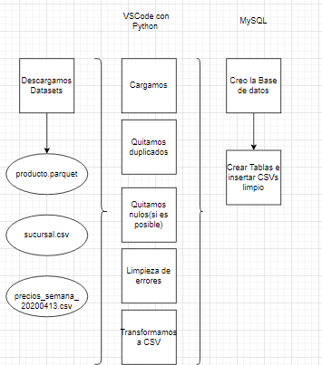
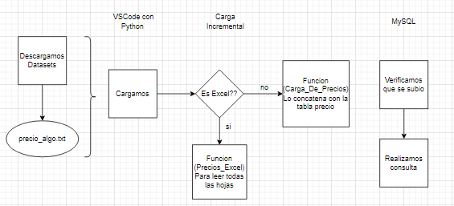
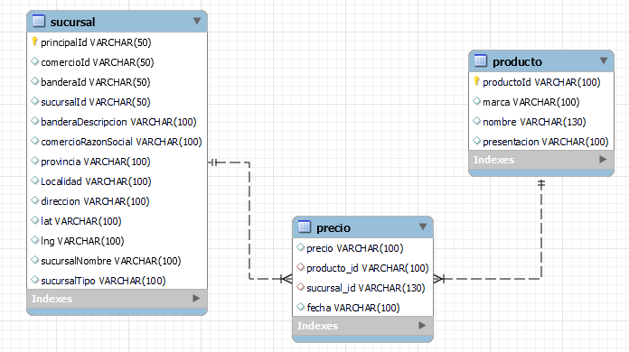

# Proyecto Individual 1- Data Engineering

## Objetivo
En este proyecto se realizar un proceso de ETL (extract, transform and load) a partir de un conjunto de datos enfocado en una misma perspectiva de negocio. Los datos vienen de diversas fuentes de relevamiento de precios en distintos mercados. El objetivo es trabajar los diferentes tipos de archivos para llevarlos a una misma extensión y, una vez finalizada esta etapa, crear los joins necesarios para poder crear un DER y dejarlos almacenados en un archivo con extensión .db. Por último, el trabajo deberá contemplar la carga incremental del archivo "precios_semana_20200518.txt".

## Pasos a seguir

- Primero debemos lograr tener las 3 tabla en MySQL

- Luego podremos hacer la carga incremental a la tabla precio

- Relaciones en MySQL

